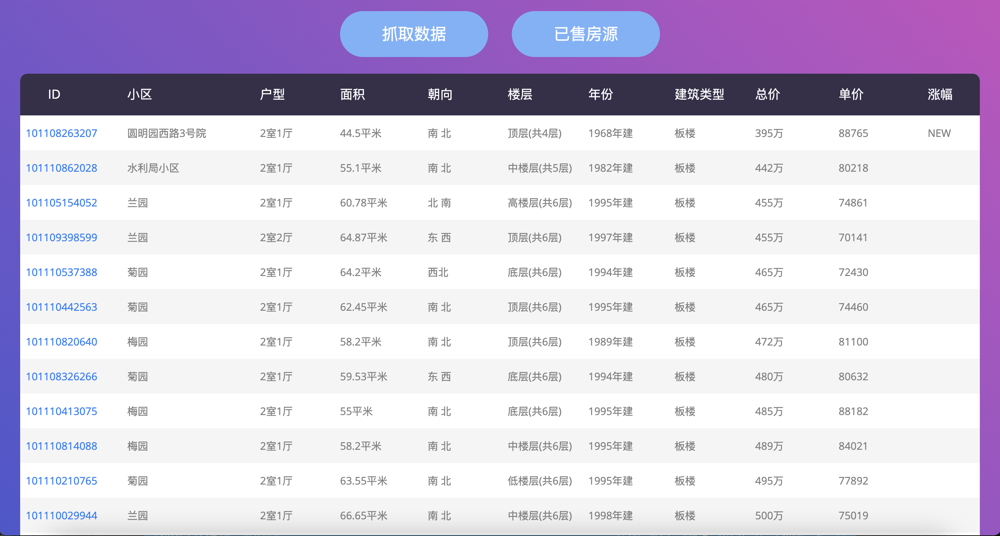
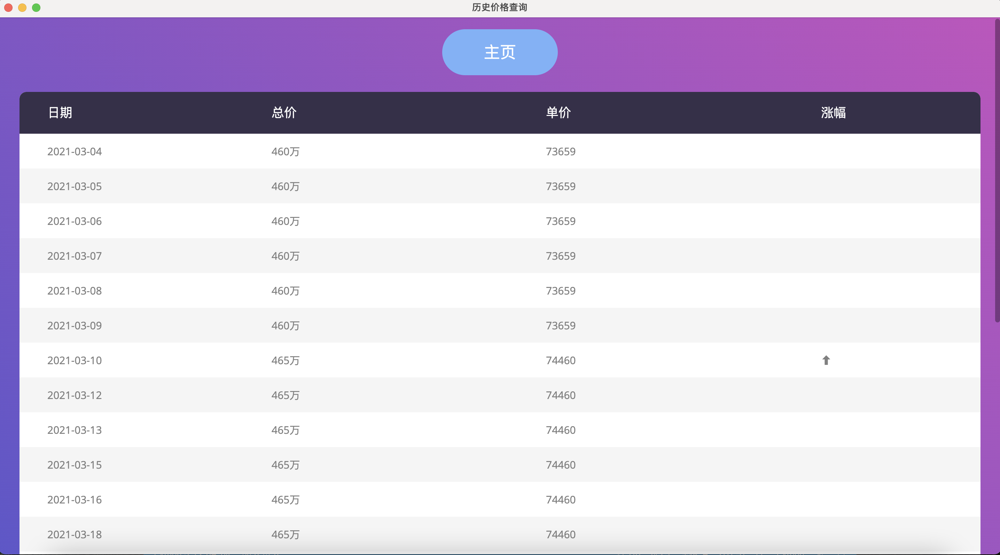
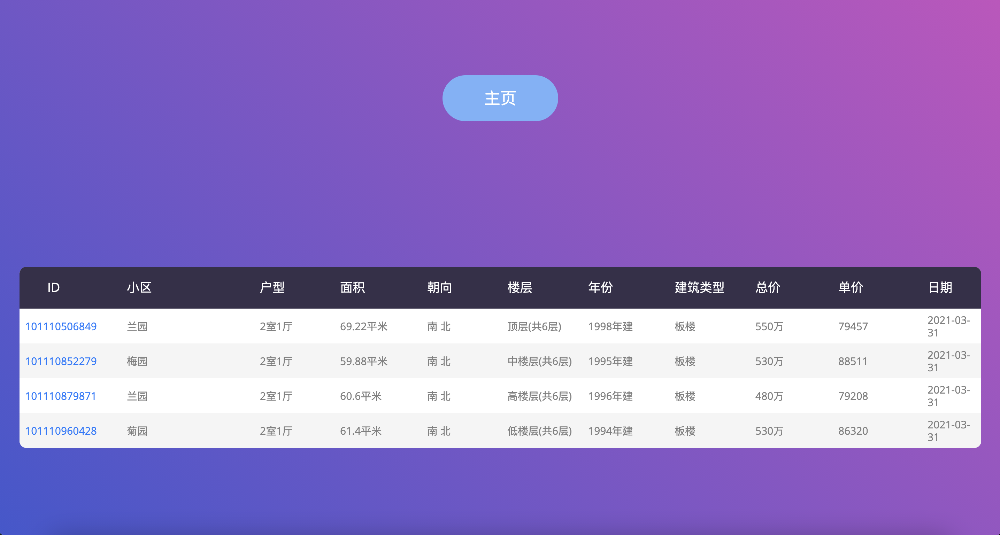

# 链家二手房爬虫工具

本工具分为爬虫端与客户端，爬虫端用于爬取链家页面二手房数据并存储于数据库，客户端用于分析展示数据库数据。

---

## 实现功能

### 爬虫端 （Python）

1. 二手房源爬取，可指定城市、地区、户型以及价格范围。
2. 每日数据存储，数据库为sqlite3，数据库文件为./lianjia.db
3. 已售房源记录，当某套房源不再能被抓取到时，将该套房源从房源表迁移到售出表，保留售出前历史数据。

### 客户端 （Nodejs）
1. 数据可视化展示，使用Electron实现跨平台，展示内容包括房源id，小区，户型，面积，朝向，楼层，年份，建筑类型，总价，单价。对于新增房源以及价格变动房源有logo标出。
2. 历史价格展示，单击某一房源后可进入历史价格页面，展示每次抓取得到的价格，并对价格的变化用箭头标出。
3. 卖出房源展示，展示已售出房源及售出日期（最后一次抓取日期）

---

## 目录结构

```
.
├── README.md
├── config
│   └── config.json
├── db
│   └── lianjia.db
├── main.js
├── package.json
├── preload.js
├── python_scripts
│   ├── database.py
│   ├── main.py
│   └── spider.py
├── static
│   ├── css
│   ├── fonts
│   ├── images
│   ├── js
│   │   ├── date.js
│   │   ├── main.js
│   │   └── sellout.js
│   └── vendor
│       
└── views
    ├── date.html
    ├── index.html
    └── sellout.html
```

1. config/config.json
   
   常量保存文件

2. db/lianjia.db
   
   数据库文件，包含HOUSE和SELLOUT两个表

3. python_scripts目录
   
   爬虫端相关代码，database.py为数据库存储代码，spider.py为爬虫相关代码，main.py为主要逻辑

4. static目录
   
   静态资源目录

5. views目录
   
   前端页面目录，date.html历史价格页面，index.html首页，sellout.html已售房源页面

6. main.js
   
   electron主要逻辑

7. preload.js
   
   Electron与页面通信的中间件

8. package.json
   
   Nodejs环境相同配置
   
---

## 使用方法

### 爬虫端

1. 安装依赖
   ```
    $ pip install requests beautifulsoup4
   ```

2. 常量设置
   ```
   # /config/config.json
   {
       "host": "https://bj.lianjia.com", # 所在城市的链家链接
       "locale": "马连洼",
       "type": "l2l3l4", # ln表示n居室
       "min_price": 0,
       "max_price": 500, # 500万
   }

   ```
3. 抓取方式
   
   a. 服务器定时执行:（***推荐***)
   ```
   $ crontab -e
   
   # 每天0点自动抓取一次数据
   00 00 * * * /path/to/python_scripts/main.py >> /path/to/lianjia_spider/spider.log
   ```

    b. 前端手动抓取:
    
    点击首页的抓取数据即可，程序输出结果显示在运行npm start的命令行上，抓取完成后需要刷新页面（windows-F5，macos-command+R），注意每天只能抓取***一次***数据。

### 客户端

1. 安装依赖库
   ```
    $ npm install
   ```
2. 运行程序
   ```
    $ npm start
   ```

---

## 程序截图

1. 房源展示页面
   


2. 历史价格展示页面
   


3. 已售房源展示页面
   
